# Informe lab 3

- Fuentes, Tiffany
- Renison, Iván
- Vispo, Valentina Solange

---

**[README](README.md) | [CONSIGNA](consigna.md) | [To Do](todo.md)**

---

# Contenido

- [Entendiendo el planificador original de xv6](#entendiendo-el-planificador-original-de-xv6)
  - [Pregunta 1](#pregunta-1)
    - [Respuesta 1](#respuesta-1)
  - [Pregunta 2](#pregunta-2)
    - [Respuesta 2a](#respuesta-2a)
    - [Respuesta 2b](#respuesta-2b)
- [Rastreando la prioridad de los procesos](rastreando-la-prioridad-de-los-procesos)
  - [MLFQ regla 3: rastreo de prioridad y asignación máxima](#mlfq-regla-3-rastreo-de-prioridad-y-asignación-máxima)
  - [MLFQ regla 4: descenso y ascenso de prioridad](#mlfq-regla-4-descenso-y-ascenso-de-prioridad)
- [Implementando MLFQ](#implementando-mlfq)
  - [MLFQ regla 1: correr el proceso de mayor prioridad](#mlfq-regla-1-correr-el-proceso-de-mayor-prioridad)
  - [MLFQ regla 2: round-robin para procesos de misma prioridad](#mlfq-regla-2-round-robin-para-procesos-de-misma-prioridad)
  - [Starvation](#starvation)
- [Mediciones y comparaciones entre los schedulers](#mediciones-y-comparaciones-entre-los-schedulers)
  - [Cómo el planificador afecta a los procesos](#cómo-el-planificador-afecta-a-los-procesos)
  - [Automatizado de testeos](#automatizado-de-testeos)
    - [AutoMed.sh](#automedsh)
    - [Extraer_archivos.sh](#extraerarchivossh)
  - [Mediciones](#mediciones)
    - [Análisis](#análisis)
- [Puntos estrellas](#puntos-estrellas)
  - [Quantum distinto por prioridad](#quantum-distinto-por-prioridad)
  - [Priority Boost de OSTEP](#priority-boost-de-ostep)
- [Mediciones MLFQ final](#mediciones-mlfq-final)
  - [Análisis](#análisis)

---

# Entendiendo el planificador original de xv6

## Pregunta 1

1. Analizar el código del planificador y responda:
   a. ¿Qué política utiliza `xv6` para elegir el próximo proceso a correr?

> Pista: `xv6` nunca sale de la función scheduler por medios "normales".

### Respuesta 1

La política que utiliza el `xv6` es **round robin**, que permite que los procesos corran consecutivamente durante un tiempo determinado denominado *quantum*.

El round robin de xv6 funciona teniendo todos los procesos en una tabla de procesos, y recorriendo esa tabla ejecutando cada ves al siguiente proceso.

```c
void
scheduler(void)
{
  // [...]
  for(;;){
    // [...]
    // Loop over process table looking for process to run.
    acquire(&ptable.lock);

    // Itera sobre todos los procesos en el orden de la tabla de procesos
    for(p = ptable.proc; p < &ptable.proc[NPROC]; p++){
      // Luego checkea si es "corrible"
      if(p->state != RUNNABLE)
        continue;

      // Switch to chosen process.
      // [...]
      // Process is done running for now.

      // It should have changed its p->state before coming back.
      c->proc = 0;
    }
    release(&ptable.lock);
  }
  // La expresión ";;" es equivalente a true => es un for infinito
  // Por lo tanto, siempre vuelve a comenzar con la iteración sobre la tabla.
}
```

## Pregunta 2

2. Analizar el código que interrumpe a un proceso al final de su *quantum* y responda:
   
    a. ¿Cuánto dura un *quantum* en `xv6`?
   
    b. ¿Hay alguna forma de que a un proceso se le asigne menos tiempo?

> Pista: Se puede empezar a buscar desde la system call `uptime`.

### Respuesta 2a

Cada vez que hay una interrupción por tiempo, el proceso que está corriendo le entrega el control al kernel, lo que quiere decir que el *quantum* dura lo mismo que el tiempo entre las interrupciones. En el archivo `lapic.c` es en donde se setean las interrupciones por tiempo, es esta parte de la función `lapicinit`:

```c
// The timer repeatedly counts down at bus frequency
// from lapic[TICR] and then issues an interrupt.
// If xv6 cared more about precise timekeeping,
// TICR would be calibrated using an external time source.
lapicw(TICR, 10000000);
```

Ese `10000000` es lo que se setea, si son la cantidad de clocks para hacer una interrupción por tiempo, la velocidad a la que se hacen los clocks depende el procesador.

Ejemplo: En un procesador con una velocidad de `900MHz` se producen 900 millones de clocks por segundo, lo que quiere decir que `10000000` de clocks se hacen en aproximadamente 0.0111 segundos que es aproximadamente una centésima de segundo.

Mas adelante, cuando hablamos de las mediciones llamamos quantum a ese número y hablamos de achicarlo y agrandarlo.

### Respuesta 2b

En el xv6 original el quantum dura siempre lo mismo, sin embargo, no necesariamente los procesos se ejecutan de forma consecutiva durante un quantum completo, ya que puede pasar que un proceso deje de ejecutarse a la mitad del quantum (por ejemplo porque inicio una lectura al sistema de archivos), y en ese caso lo que pasa es que se elige otro proceso para correr, pero solo corre hasta que que pasan `10000000` clocks desde que se eligió el primer proceso, no el segundo. Esto es porque las interrupciones por tiempo ocurren siempre cada `10000000` clocks, sin importar cuantos clocks lleva corriendo el proceso actual.

# Rastreando la prioridad de los procesos

Habiendo visto las propiedades del planificador existente, reemplazarlo con un planificador MLFQ de tres niveles. Esto se debe hacer de manera gradual, primero rastrear la prioridad de los procesos, sin que esto afecte la planificación.

1. Agregue un campo en `struct proc` que guarde la prioridad del proceso (entre `0` y `NPRIO-1` para `#define NPRIO 3` niveles en total) y manténgala actualizada según el comportamiento del proceso:
   
   * MLFQ regla 3: Cuando un proceso se inicia, su prioridad será máxima.
   
   * MLFQ regla 4:
     
     * Descender de prioridad cada vez que el proceso pasa todo un *quantum* realizando cómputo.
     
     * Ascender de prioridad cada vez que el proceso bloquea antes de terminar su *quantum*.
       
       > Nota: Este comportamiento es distinto al del MLFQ del libro.

2. Para comprobar que estos cambios se hicieron correctamente, modifique la función `procdump` (que se invoca con `CTRL-P`) para que imprima la prioridad de los procesos. Así, al correr nuevamente `iobench` y `cpubench`, debería darse que `cpubench` tenga baja prioridad mientras que `iobench` tenga alta prioridad.

## MLFQ regla 3: rastreo de prioridad y asignación máxima

* El valor **máximo de la prioridad** es el valor `0`,
* y el valor `NPRIO` es la **prioridad mínima**.

Explicación de los archivos:

* `trap.h`: define los "traps" y los *interrupts del kernel*.

Entre ellos está el siguiente:

```c
#define IRQ_TIMER        0
```

Este define el interrupt llamado periódicamente por el hardware que usa el scheduler para medir los *quantums*.

* `trap.c`: este implementa todas las traps, entre ellas las **syscalls** (con la función de su mismo nombre, `syscall()`) y los **interrupts del timer** (con la función `yield()`).

Para asegurar que los procesos se inicien con la prioridad más alta, en la función `allocproc` (que se encarga de inicializar el estado requerido del proceso para poder ejecutarlo en el kernel) del archivo `proc.c`, para un proceso `p` se inicializa su prioridad como `p->priority = 0`.

## MLFQ regla 4: descenso y ascenso de prioridad

Donde el **descenso de prioridad** ocurre en el `yield()`

```c
// Force process to give up CPU on clock tick.
// If interrupts were on while locks held, would need to check nlock.
if(myproc() && myproc()->state == RUNNING &&
    tf->trapno == T_IRQ0+IRQ_TIMER)
  yield();
```

Y el **ascenso de prioridad** ocurre en el `sleep()` ya que es donde se cambia de estado de `RUNNING` a `SLEEPING` y esto indica que el proceso pasa a estar **bloqueado**, como lo indica la regla 4.

# Implementando MLFQ

Finalmente implementar la planificación propiamente dicha para que nuestro `xv6` utilice MLFQ.

1. Modifique el planificador de manera que seleccione el próximo proceso a planificar siguiendo las siguientes reglas:
   
   * MLFQ regla 1: Si el proceso `A` tiene mayor prioridad que el proceso `B`, corre `A`. (y no `B`)
   * MLFQ regla 2: Si dos procesos `A` y `B` tienen la misma prioridad, corren en *round-robin* por el *quantum* determinado.

2. Repita las mediciones de la segunda parte para ver las propiedades del nuevo planificador.

3. Para análisis responda: ¿Se puede producir `starvation` en el nuevo planificador? Justifique su respuesta.

> Importante: Mucho cuidado con el uso correcto del mutex `ptable.lock`.

## MLFQ regla 1: correr el proceso de mayor prioridad

Para poder facilitar el manejo de las prioridades disidimos usar colas, para hacer esto cambiamos el `struct ptable` del archivo `proc.c` que tiene la estructura de la tabla de procesos, para que contenga dos arreglos de punteros a procesos, `queue_first` que contiene los primeros procesos en la cola de cada prioridad, y `queue_last` que contiene los últimos procesos de la cola. También modificamos el `struct proc` que contiene la estructura de los procesos para añadir un puntero `next_proc` el cual va a apuntar al siguiente proceso en la cola.

Al inicializarse `xv6` la memoria se inicializa en 0, por lo que las colas se inicializan en 0, luego al inicializarse un proceso en `userinit`, esta función hace una llamada a `allocproc` que asigna la prioridad más alta al proceso, y luego se encola en la cola correspondiente. En el planificador se realiza un ciclo para encontrar el proceso de la prioridad más alta revisando el primer proceso de la cola de cada prioridad, dado que las colas solo tienen procesos que están en estado `RUNNABLE`, con ver si el primer elemento de la cola existe es suficiente para saber si hay procesos de dicha prioridad por correr. El ciclo comienza revisando la cola de prioridad más alta (prioridad 0), por lo que siempre se va a correr el proceso de mayor prioridad.

Para asegurarnos de que en las colas solo haya procesos en estado `RUNNABLE`, luego de correr cada proceso se saca de su cola haciendo `dequeue`, de esta forma si el proceso pasa a cualquier otro estado sólo se vuelve a encolar cuando pasa nuevamente a estado `RUNNABLE`, como por ejemplo en `wakeup` donde el proceso pasa de estado `SLEEP` a `RUNNABLE`.

Lo más importante de la implementación con colas es que mejora ligeramente el rendimiento, ya que si no habría que recorrer la tabla completa de procesos para encontrar uno para ejecutar.

## MLFQ regla 2: round-robin para procesos de misma prioridad

Con la implementación que tenemos siempre se va a correr el proceso de prioridad más alta que este en estado `RUNNABLE`, luego de ejecutarse este proceso se van a revisar las colas nuevamente para buscar otro proceso por correr, en caso de que no haya un proceso de prioridad más alta que el que se ejecutó anteriormente, se seguirán ejecutando los procesos de la misma cola de prioridad de el proceso anterior, de esta forma los procesos de la misma prioridad se corren en *round-robin* por el *quantum* establecido.

Es importante observar que en esta implementación siempre que se acaba el quentum de un proceso (sin importar cuento tiempo consecutivo llevaba ejecutándose) se baja la prioridad del proceso.

## Starvation

En la consigna se pregunta si se puede producir `starvation` en el nuevo planificador, y la respuesta es que si, porque si hay un proceso largo `IO bound`, o si hay varios procesos IO bound, con la política de ascensión que se implementó cada vez que se bloquea un proceso se le sube la prioridad, es decir que un proceso que devuelva el control al kernel antes de que termine el quantum ya que se bloquea siempre se va a mantener en la prioridad más alta, por lo que los procesos que estén en la prioridad más baja nunca tienen oportunidad de correr.

# Mediciones y comparaciones entre los schedulers

## Cómo el planificador afecta a los procesos

El tipo de planificador puede influir en cuantos recursos se le asignan a cada proceso. En particular, el planificador *round robin* que viene en `xv6` asigna el mismo *quantum* a todos los procesos, mientras que el planificador MLFQ (Multi Level Feedback Queue) asigna *quantums* distintos a cada proceso dependiendo de su prioridad.

Es interesante y muy útil, saber como afecta de distinta manera a los procesos de distintos tipos. Para eso, junto con la consigna nos dieron 2 programas para realizar distintas mediciones.

El programa `cpubench` mide la cantidad de operaciones de punto flotante que puede hacer en una cierta cantidad de ticks del sistema operativo. En particular, las operaciones en `MINTICKS` (definido por defecto en `250`) ticks del sistema operativo, y lo imprime en KFLOPT (Kilo Floating Point Operations Per Tick) (por defecto pone como unidad MFLOPT (mega en lugar de kilo), pero es un error, ya que lo calcula en kilo).

Los ticks del sistema operativos se obtienen con la llamada al sistema `uptime` y son la cantidad de interrupciones por timer producidos desde el inicio del sistema. Esto causa que si se hace que el timer sea más chico, las mediciones de `cpubench` den menos, porque obviamente en menos tiempo se hacen menos cosas, pero, tiene la ventaja de que no depende de la velocidad del procesador, ya que por más que cambie la velocidad a la que el procesador ejecuta las instrucciones, la cantidad de instrucciones ejecutadas entre una interrupción y la otra son las mismas.

El otro programa que dieron es `iobench` que mide la cantidad de escrituras y lecturas de un archivo que puede hacer en `MINTICKS` ticks del sistema operativo, y las imprime en IOP`MINTICKS`T (Input Output Operations Per `MINTICKS` Ticks).

Nosotros decidimos modificar un poco estos programas, para hacer que en lugar de imprimir la cantidad de operaciones por cierta cantidad de ticks, imprima la cantidad de operaciones y la cantidad de ticks por separado, para hacer nosotros la división, y evitar la perdida de error por el redondeo de la división entera (en `iobench` habían hecho que se imprima en `MINTICKS` ticks posiblemente para evitar un poco eso, pero nos pareció mejor directamente imprimir todo).

## Automatizado de testeos

En la consigna se pide ejecutar en distintas combinaciones estos programas con el planificador por defecto y con el nuestro, para poder compararlos. Hacer eso a mano es bastante trabajo, así que nosotros decidimos intentar automatizarlo un poco.

Para automatizarlo hicimos 2 scripts en la carpeta `Automatizar_mediciones`, uno que se encarga de ejecutar todos los test y guardar los resultados en archivos dentro de `xv6`, y otro que se encargue de extraer de `xv6` esos archivos.

A continuación una explicación de como funciona cada uno de ellos:

### AutoMed.sh

Este es el script que se encarga de ejecutar los tests, redirigiendo las salidas a archivos dentro de `xv6`.

Lo que hace es tener una lista de los comandos a ejecutar en cada test y para cada uno ejecuta `xv6` durante un cierto tiempo pasándole a la entrada estándar el comando de este test.

### Extraer_archivos.sh

Este es el script que se encarga de extraer los archivos de `xv6`.

Lo que hace es tener una lista de los archivos que tiene que extraer, y para cada uno ejecuta qemu pasándole a la entrada estándar `cat nombre_del_archivo`, y redirigiendo la salida a un archivo del mismo nombre en Linux, quitándole las primeras 14 lineas, que son los que se imprime hasta el `cat`, y los últimos 2 caracteres que son el `$` que se imprime después.

Para generar los comandos que hay que ejecutar y los nombres de los archivos que hay que extraer usamos un pequeño archivo de haskell `Generador_listas.hs`, en donde `comandos_test` son los comandos y `archivos_test` los archivos.

Para usar los scripts hay que, desde la carpeta `xv6-modularized`, después de haber hecho un `make qemu` para que se compile `xv6`, hacer `bash ../Automatizar_mediciones/AutoMed.sh` para correr los test y después `bash ../Automatizar_mediciones/Extrear_archivos.sh` para extraer los archivos.

## Mediciones

En la consigna se pide hacer mediciones con distintas cantidades de `iobench` y `cpubench` y usando el *quantum* normal, 10 , 100 y 1000 veces menor para el `scheduler` original y el nuestro antes de hacer los puntos estrellas (y opcionalmente después, ahora vamos a hacer la comparación entre esos 2).

A las mediciones con 1000 veces menor decidimos no realizarlo ya que el `xv6` se vuelve tan lento que hace falta mucho tiempo para obtener alguna medición y mucho mas todavía para obtener muchas mediciones como para que sea mas preciso.

Las versiones exactas en las que hicimos las mediciones están etiquetadas en el repositorio de bitbucket como `hacer_mediciones` la versión de las mediciones scheduler original y como `Medir_MLFQ_simple` a la de nuestro scheduler. La etiqueta`Medir_MLFQ_simple` está en una rama que después no se fusiona a `master` y eso puede parecer muy raro, pero es porque en la primera versión en la que teníamos el MLFQ sin bugs ya teníamos hecho para que haya distinto *quantum* para las distintas colas, entonces des-hicimos eso en esa rama para hacer las mediciones

Cada vez que eliminábamos un 0 del *quantum* para hacer una medición, en los archivos `cpubench` e `iobench` aumentábamos por un cero la variable `MINTICKS` para que de esta manera los programas corran durante la misma cantidad de tiempo antes de imprimir un resultado.

Para poder comparar los resultados en los distintos schedulers hicimos un gráfico para cada *quantum* para cada scheduler en el cuál se puede ver cuantas operaciones por tick hizo en **promedio** cada uno de los programas en ese caso. En la carpeta mediciones se encuentran los datos y en la carpeta gráficos se encuentra el programa de jupyter notebooks que tiene el código con el cuál se realizaron los gráficos.

A continuación están los gráficos para cada *quantum*, a la izquierda el del scheduler original de `xv6` y a la derecha de nuestro MLFQ:

| 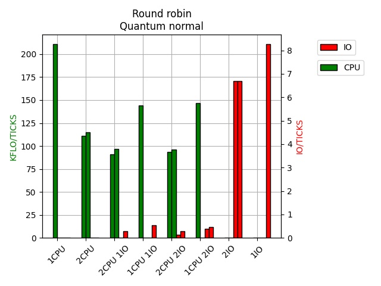             | 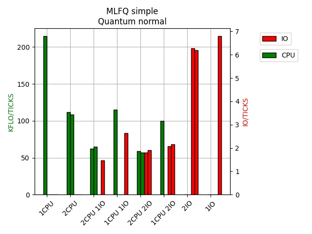               |
| ----------------------------------------------------------------------------------- | ---------------------------------------------------------------------------------- |
| 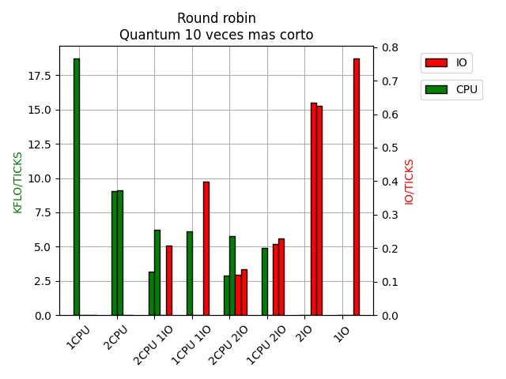    | 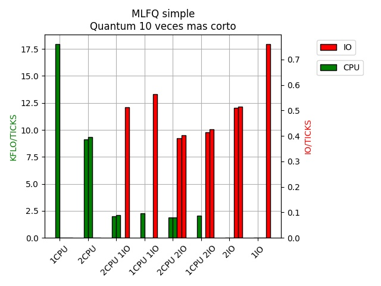    |
| 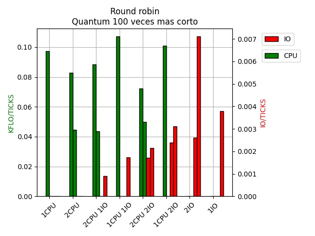 | 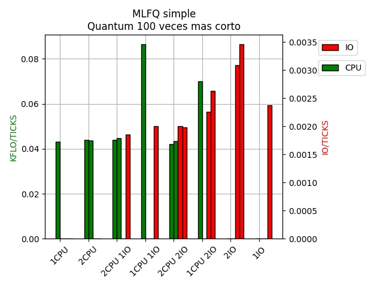 |

### Análisis

En los gráficos se puede ver que cuando hay CPU e IO mesclados a los IO les va mucho mejor con el MLFQ que con el round robing, lo cual es lo esperado. En el caso del quantum 100 veces menor los datos se ven un poco raros, lo cuál posiblemente se deba a que nosotros hicimos todas les mediciones dejando correr a los programas durante 5 minutos, lo cual para quantum normal y 10 veces mas corto alcanza para un montón de mediciones, pero para el 100 veces mas corto no alcanza para tantas mediciones.

Otra cosa interesante es saber cual planificador es mas eficiente, en el sentido de que pierde menos tiempo eligiendo un proceso.

Mirando el código es difícil saber, ya que el MLFQ tiene menos código para elegir un proceso, pero tiene que andar encolando y descolando a los procesos.

La mejor forma que se nos ocurre de comparar eso es comparar a cuantos KFLO/TICK llega con un solo `cpubench` en cada uno, y a cuantos IO/TICK llega con un solo `iobench`  en cada uno, ambas cosas para quantum normal y para quentum 10 veces mas corto (para 100 veces mas corto no por lo de que son muy imprecisos los datos).

En esta tabla están esos datos:

|                                | Caso                         | Round robing | MLFQ simple |
| ------------------------------ | ---------------------------- | ------------ | ----------- |
| Quantum<br/>normal             | KFLO/TICK<br/>(1 `cpubench`) | 210.71       | 214.55      |
|                                | IO/TICK<br/>(1 `iobench`)    | 8.2594       | 6.7898      |
| Quantum 10<br/>veces mas corto | KFLO/TICK<br/>(1 `cpubench`) | 18.701       | 17.925      |
|                                | IO/TICK<br/>(1 `iobench`)    | .76522       | .75951      |

Como se puede ver, no hay demasiada diferencia en estos datos, en 3 de los casos le fue mejor a round robing y en 1 al MLFQ.

La mayor diferencia está en 1 `iobench` con quantum normal (21.6 %), que es el caso en el que posiblemente se shedulee mas veces por tick (si se hacen una 8 operaciones por tick, se shedulea unas 8 veces por tick por lo menos, porque cada ves que se inicia un IO request se shedulea). En el caso del `cpubench` solo se shedulea una vez por tick, por lo que el tiempo de sheduleo posiblemente sea mucho mas insignificante.

# Puntos estrellas

- Del planificador:
  
  1. [x] Reemplace la política de ascenso de prioridad por la regla 5 de MLFQ de OSTEP: **Priority boost**.
  
  2. [x] Modifique el planificador de manera que los distintos niveles de prioridad tengan distintas longitudes de *quantum*.
  
  3. [ ] Cuando no hay procesos para ejecutar, el planificador consume procesador de manera innecesaria haciendo `busy waiting`. Modifique el planificador de manera que ponga a dormir el procesador cuando no hay procesos para planificar, utilizando la instrucción `hlt`.
  
  4. [ ] (Difícil) Cuando `xv6` corre en una máquina virtual con **2 procesadores**, la performance de los procesos varía significativamente según cuántos procesos haya corriendo simultáneamente. ¿Se sigue dando este fenómeno si el planificador tiene en cuenta la localidad de los procesos e intenta mantenerlos en el mismo procesador?
  
  5. [ ] (Muy difícil) Y si no quisiéramos usar los *ticks periódicos del timer* por el problema de *(1)*, ¿qué haríamos? Investigue cómo funciona e implemente un **tickless kernel**.

- De las herramientas de medición:
  
  - [ ] Llevar cuenta de cuánto tiempo de procesador se le ha asignado a cada proceso, con una system call para leer esta información desde espacio de usuario.

## Quantum distinto por prioridad

En el planificador original de `xv6` un *quantum* mide lo mismo que un tick del sistema, el cual esta definido en `lapic.c` y el cual dura 10 millones de clocks del procesador, cada vez que se aumenta el tick de `xv6` es porque ocurrió una interrupción por tiempo. En `trap.c` se encuentra este fragmento de código:

```c
// Force process to give up CPU on clock tick.
// If interrupts were on while locks held, would need to check nlock.
  if(myproc() && myproc()->state == RUNNING && tf->trapno == T_IRQ0+IRQ_TIMER)
    yield();
```

Es decir que cada vez que hay una interrupción por tiempo el proceso devuelve el CPU, lo que quiere decir que se terminó su *quantum*. Para poder agregar un *quantum* distinto para cada prioridad habría que modificar esta parte del código.

Decidimos que el *quantum* de cada prioridad sería de la siguiente manera:

| Prioridad | Quantum |
| --------- | ------- |
| 0         | 1 tick  |
| 1         | 2 ticks |
| 2         | 4 ticks |

Es decir para cada prioridad su *quantum* sería igual a 2^prioridad.

Para poder llevar la cuenta del tiempo (cantidad de ticks) que llevaba cada proceso corriendo en su prioridad actual añadimos un campo al `struct proc` del archivo `proc.h` llamado `ticks_running`. Cada vez que se inicia un proceso el mismo se inicializa con `ticks_running = 0`, luego mientras el proceso se está ejecutando, cada vez que ocurra una interrupción por tiempo se aumenta esta variable en 1 y se revisa si `ticks_running` es mayor o igual a su *quantum* correspondiente y en este caso se hace `yield()` y se devuelve el CPU.

En algunos casos los procesos pueden bloquearse antes de terminar con su *quantum*, lo que quiere decir que no llaman a `yield` por lo que al proceso no se le baja la prioridad, y cuando vuelve a correr en la misma prioridad tiene un *quantum* completo para correr, para que esto no suceda decidimos que solo se reinicia la variable `ticks_running` (es decir se coloca en 0), cuando el proceso hace `yield`, de esta manera si el proceso se bloquea sin haber terminado el cuanto se lleva la cuanta de por cuantos ticks se había ejecutado antes de bloquearse.

Debido a que la única forma que encontramos de llevar la cuenta del tiempo pasado en `xv6` fue utilizando la variable `ticks`, esto quiere decir que no tenemos una precisión muy grande, así que por ejemplo en caso de que un proceso este corriendo y siempre se bloquee antes de que pase un `tick` nunca haría `yield`, y como la única forma que tenemos de llevar la cuenta del tiempo corrido es utilizando `ticks` la variable `ticks_running` nunca aumentaría, por lo que este proceso siempre quedaría en la prioridad más alta.

Finalmente la parte modificada de `trap.c` quedó de la siguiente manera:

```c
// Force process to give up CPU on clock tick.
// If interrupts were on while locks held, would need to check nlock.
if(myproc() && myproc()->state == RUNNING && tf->trapno == T_IRQ0+IRQ_TIMER){
  myproc()->ticks_running++;
  // quantum = 2^priority ticks
  if(1 << myproc()->priority <= myproc()->ticks_running)
    yield();
}
```

Observar que como en `xv6` no tenemos la manera de representar potencias 2^prioridad es equivalente a 1 << prioridad, en donde << se refiere a un logical shift left.

## Priority Boost de OSTEP

En este punto se cambio la implementación anterior del priority boost en el que se asciende la prioridad del proceso cada vez que este se bloquea, a una implementación mas parecida a la del libro OSTEP en la que se asciende la prioridad de todos los procesos a la prioridad más alta cada cierta cantidad de tiempo.

Para hacer esto creamos una función `priority_boost` en el archivo `proc.c` en el cual se recorren todos los procesos en la tabla de procesos y se coloca la prioridad de cada uno en 0 (que es la prioridad más alta). Decidimos definir una constante `BOOSTTIMER` que se encuentra definida en el archivo `param.h` para establecer la cantidad de ticks que pasan entre cada priority boost.

Cada vez que se realiza una interrupción por tiempo en `xv6` se aumenta el contador de ticks que son los que llevan la cuenta del tiempo que ha pasado, por eso decidimos que en el archivo `trap.c`, en donde se aumenta la variable ticks , se chequee si ya paso la cantidad de tiempo definido por la constante `BOOSTTIMER`, de esta forma si `ticks % BOOSTTIMER == 0` se hace la llamada a `priority_boost` para ascender la prioridad de los procesos.

Debido a la implementación con colas que manejamos luego de ascender la prioridad de los procesos es importante actualizar el primer y último elemento de cada cola de prioridad, en este caso lo que hacemos es concatenar los procesos de manera que el último proceso de cada cola apunte al primer proceso de la siguiente cola no vacía. A continuación colocamos unas imágenes para que se entienda mejor el proceso.

Colas antes del priority boost:

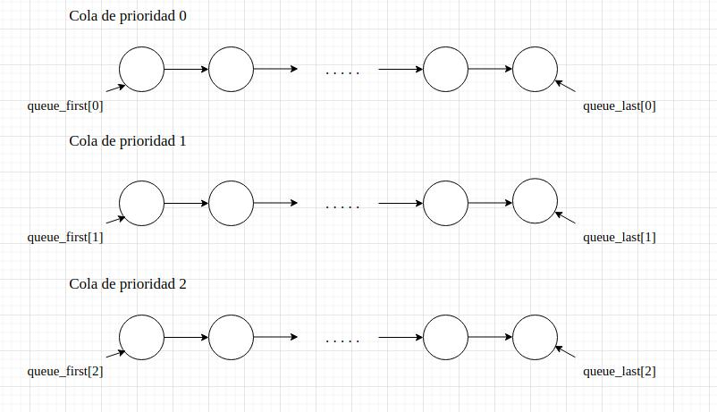

Colas después del priority boost:

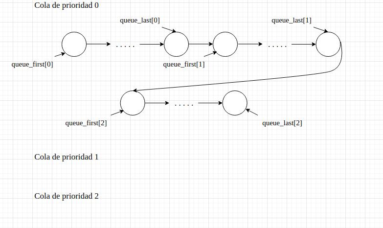

# Mediciones MLFQ final

Finalmente, a pesar de que no se indica en la consigna, decidimos hacer una medición final con el planificador MLFQ que incluye la implementación de los puntos estrellas indicados anteriormente, para poder ver como varía su desempeño en comparación al MLFQ básico y al planificador *round-robin*.

* *Quantum* normal:

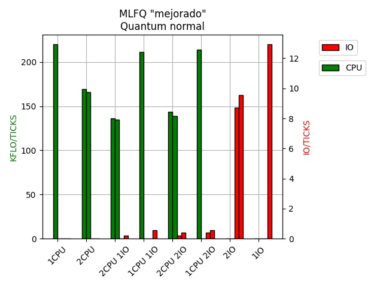

* *Quantum* 10 veces menor:

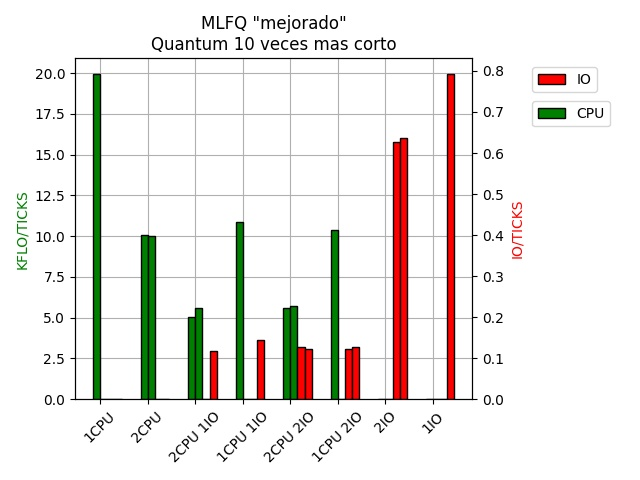

* *Quantum* 100 veces menor:

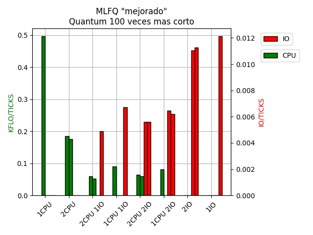

### Análisis

En estos gráficos se puede ver que con quantums largos a los `iobench` les fue peor que con el otro MLFQ, pero con quantums cortos les fue mejor. Esto no sabemos con exactitud porque es, pero tenemos alguna idea:

Notamos que cuando el quantum es largo y las operaciones IO se demoran menos de lo que dura el quantum, los procesos `iobench` se acaban bajando de prioridad bastante rápido y están la mayor parte del tiempo en la prioridad mínima junto con los `cpubench`. 

Cuando el quantum es mas corto, y las operaciones IO se demoran muchos quantums en cambio, los procesos `iobench` si están mucho mas en la proridad mas alta, mientras que los `cpubench` bajan.

El porque pasa eso no lo tenemos del todo claro, pero creemos que debe tener que ver con que si los `iobench` están en prioridad mas alta, se los elige mas y cuando hay una interrupción por tiempo, siempre el proceso que está corriendo es un `iobench` (cuando hay una interrupción por tiempo se baja la prioridad del `iobench`).

---

**[README](README.md) | [CONSIGNA](consigna.md) | [To Do](todo.md)**